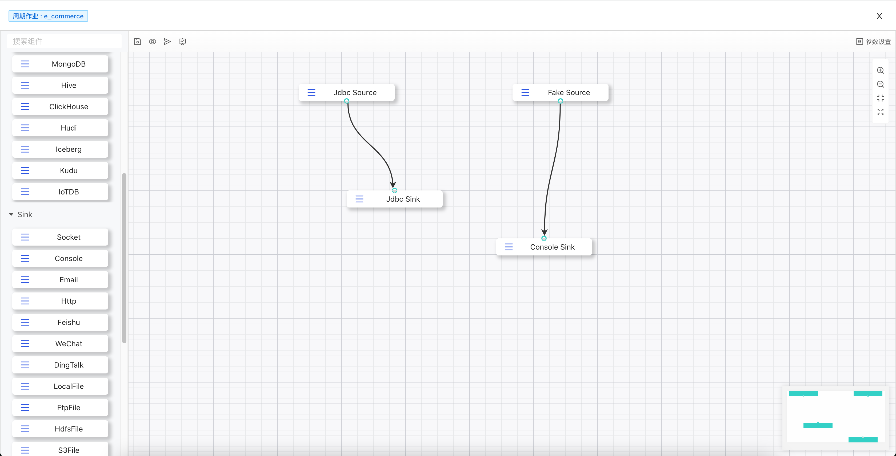

[//]: # (![logo]&#40;_media/icon.svg&#41;)

<h1> Scaleph </h1>

> Scaleph ['skəlef] 是一个基于 Apache Flink 和 Apache SeaTunnel(Incubating) 的开源可视化数据开发 & 管理系统

- Drag and Drop 可视化开发 SeaTunnel 同步任务
  - 全面支持 2.3.0-beta 版本 V2 connectors
  - 独立的数据源管理功能
  - 作业多版本管理

- Flink 任务开发
  - 支持 Standalone、YARN、Kubernetes 部署
  - 支持 Session、Application、Per-Job 运行方式
  - 设计良好的分布引导表单，聚焦 Flink 运行关键配置

- 任务依赖和调度
  - 开发中～

开源不易，你们的鼓励就是 contributor 的动力，走过路过的点个 star ~

[GitHub](https://github.com/flowerfine/scaleph)
[Get Started](#关于Scaleph)

<!-- 背景图片 -->

