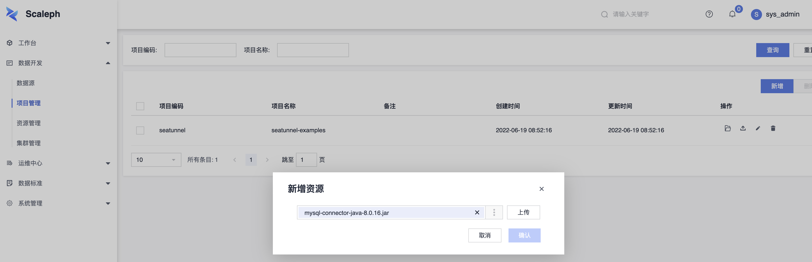
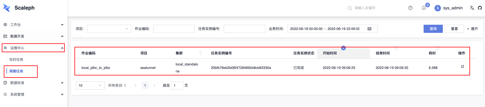

# develop

This doc describes how to set up development environment for Scaleph and run the server and web on IDE.

## requirements

- Git
- Java 11
- Maven
- Mysql 8.0
- redis
- node v16.14.0
- flink
- IDE. eg. IDEA
    - IDE plugin. lombok


## clone

Clone the source code repository from [github](https://github.com/flowerfine/scaleph):

```shell
git clone https://github.com/flowerfine/scaleph.git --depth 1
mvn install -DskipTests
mvn -B -T 4 clean package -DskipTests -Dfast
```

## environment

If users are familiar with docker, Scaleph provides mysql, redis and minio environment through docker container. User can launch local deleop environment as follows:

```shell
cd tools/docker/local

docker compose up -d
```

If docker is unavailable for user, you has to create mysql, redis and minio by yourself.

You would find sql scripts on `${scaleph_home}/tools/docker/mysql/init.d` and execute `scaleph-master-mysql.sql`, `scaleph-log-mysql.sql`, `scaleph-flink-mysql.sql`，`qutz-mysql.sql` on your mysql.

### flink and seatunnel release

Next, download [flink](https://flink.apache.org/downloads.html#apache-flink-1136) (version 1.13.6) and prepare flink environment, you could get more information on [Standalone](https://nightlies.apache.org/flink/flink-docs-release-1.13/docs/deployment/resource-providers/standalone/overview/#standalone).

```shell
# download flink-1.13.6
curl -LsO https://archive.apache.org/dist/flink/flink-1.13.6/flink-1.13.6-bin-scala_2.11.tgz

# untar flink
tar -zxf flink-1.13.6-bin-scala_2.11.tgz

# start flink cluster
cd flink-1.13.6
./bin/start-cluster.sh

# stop flink cluster
./bin/stop-cluster.sh
```

clone [seatunnel](https://github.com/apache/incubator-seatunnel) and build from the source code.

```shell
# clone seatunnel
git clone https://github.com/apache/incubator-seatunnel.git --depth 1
cd seatunnel

# build seatunnel
docker run -it --rm \
--name seatunnel-build \
-v "$(pwd)":/usr/src/seatunnel \
-w /usr/src/seatunnel \
maven:3.8-openjdk-8 \
mvn -B -U clean package -DskipTests -Dfast

# build seatunnel with local repository and custom central repository mirror
docker run -it --rm \
--name seatunnel-build \
-v /path/to/settings.xml:/usr/share/maven/ref/settings.xml \
-v /path/to/repository:/usr/share/maven/ref/repository \
-v "$(pwd)":/usr/src/seatunnel \
-w /usr/src/seatunnel \
maven:3.8-openjdk-8 \
mvn -B -U clean package -DskipTests -Dfast

# untar seatunnel
cd seatunnel-dist/target
tar -zxf apache-seatunnel-incubating-xxx-bin.tar.gz
```

## start backend

Import the Scaleph project into an IDE for the development itself.

Start backend server through `cn.sliew.scaleph.Application` on `scaleph-api` module.

## start frontend

Install dependencies. Note: this step only needs when first time bootstraps frontend service.

```shell
cd scaleph-ui-react

npm install --force
```

Start frontend server:

```shell
npm start
```

After web server started, user can open http://localhost:8000/ in browser and admin account is `sys_admin/123456`.

### try local jdbc_to_jdbc seatunnel job

1. update `seatunnel_home`. `系统管理 -> 系统配置 -> 基本设置: seatunnel Home`.
2. upload `mysql-connector-jdbc-xxx.jar`. MySQL license is not compatible with Apache 2.0 license and seatunnel release doesn't contain any JDBC driver dependency, user have to provide it by themselves.
3. start `local_jdbc_to_jdbc` job.







## swagger ui

After backend and frontend server started, user can access http://localhost:8080/scaleph/doc.html in browser, where Scaleph uses [knife4j](https://doc.xiaominfo.com/knife4j/documentation/) and [swagger](https://swagger.io/) build open api documentation.

knife4 features useful http api debug functionality supporting send request to backend server. Scaleph's authentication and authorization requires that http request must contain `u_token` header, which will cause that backend server rejects knife4j requests. The solution is that user adds a global param setting within path `文档管理/全局参数设置/添加参数`, the `u_token` header value can be found on browser develop console.

