#
# 初始化
1. 上传 Flink release,当前仅支持 flink 1.13.6.
   - 资源 -> Flink Release -> 上传

   
   
2. 上传 Seatunnel release,当前仅支持 v2.3.0
   - 资源 -> Seatunnel Release -> 上传
   
   
   
   3. 上传[Seatunnel Connectors](https://repo1.maven.org/maven2/org/apache/seatunnel)
   
   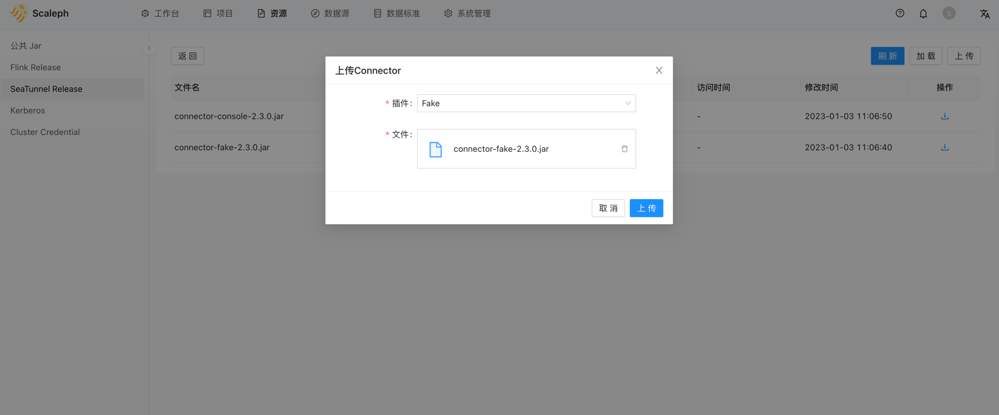
3. 创建集群凭证

   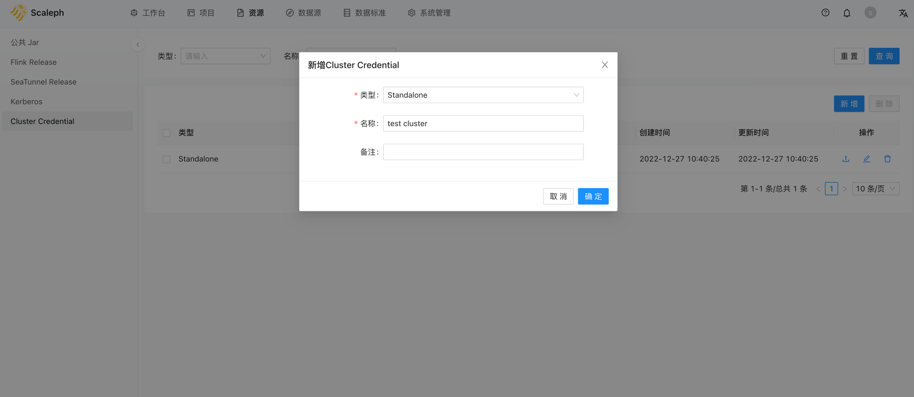
   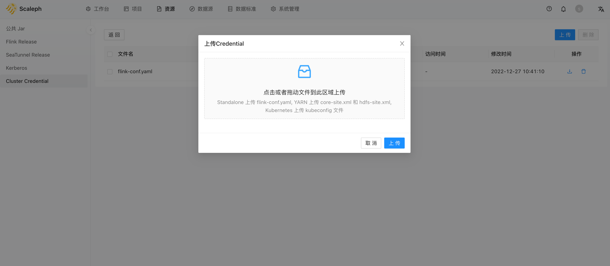

# 创建项目

1. 项目 -> 创建项目

   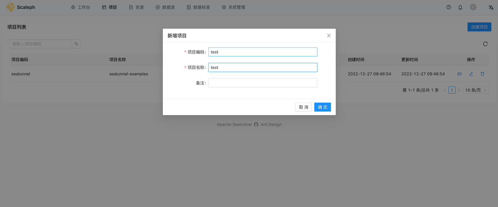

# 创建集群

1. 进入项目 -> 集群管理 -> 集群配置

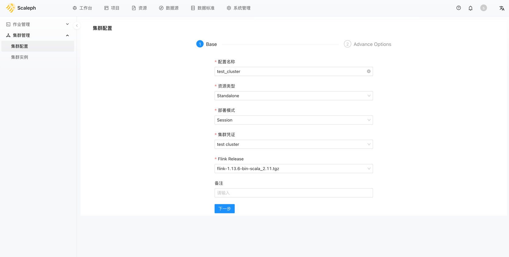
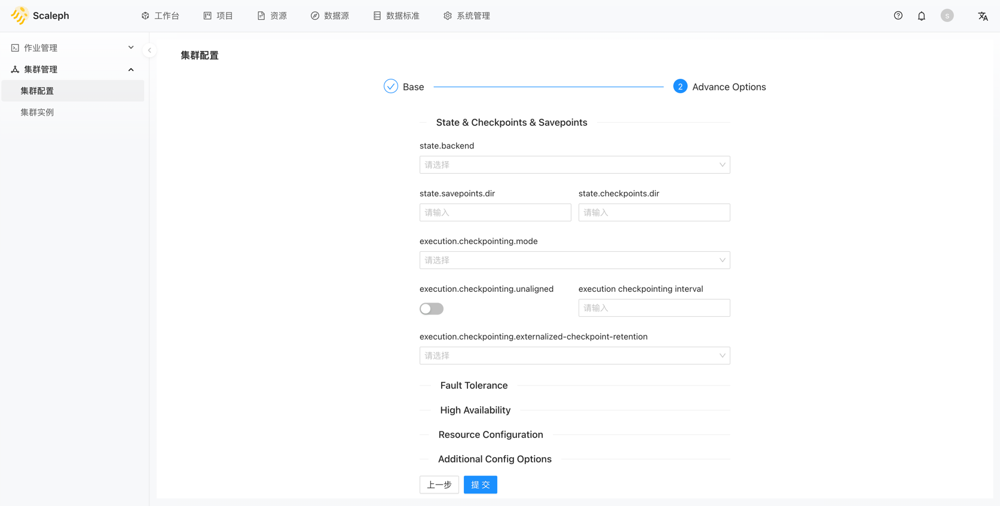

2. 集群配置 -> 生成集群实例

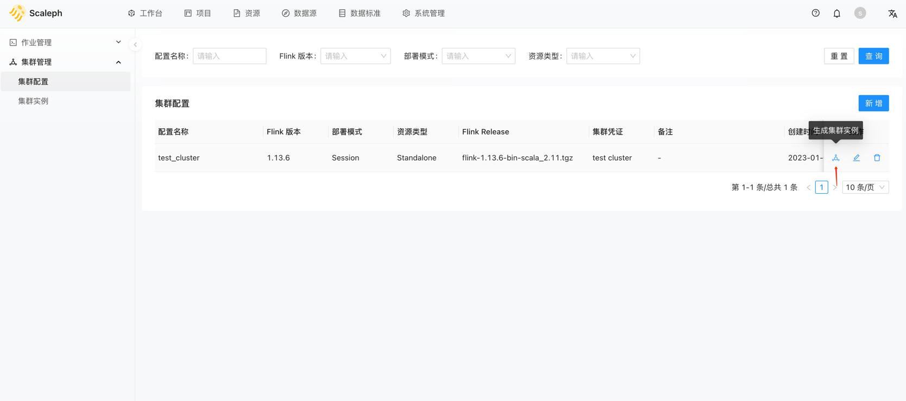
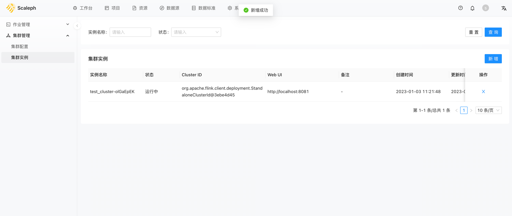

# 创建作业

## Seatunnel 

1. 进入项目 -> 作业管理 -> Seatunnel

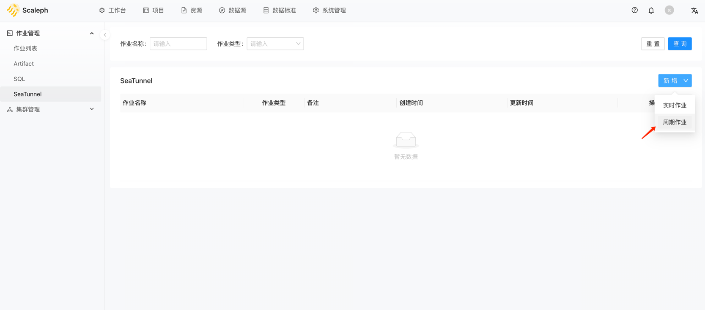

2. 编辑并保存作业

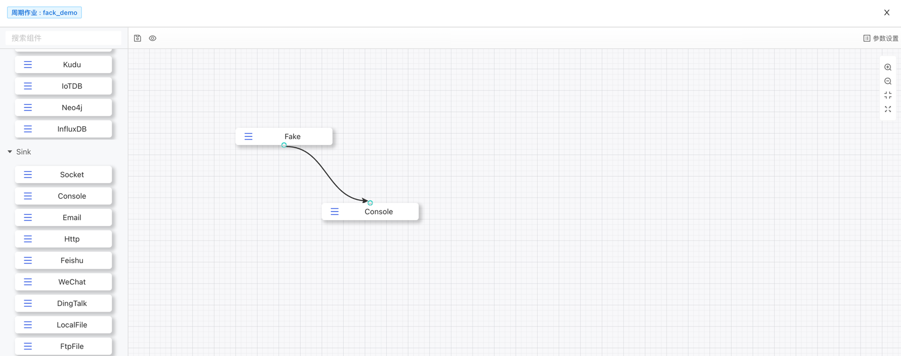

## Jar

1. 进入项目 -> 作业管理 -> Artifact -> 新增

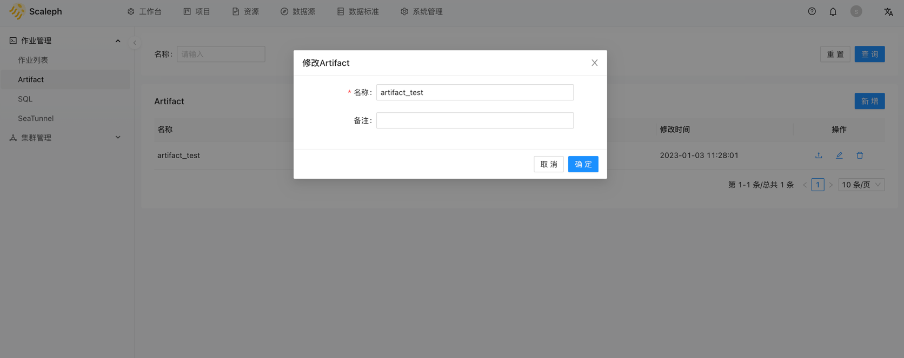

2. 上传Jar

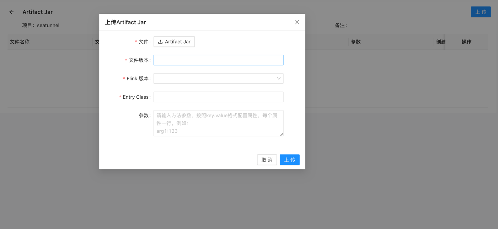

# 部署作业

1. 进入项目 -> 作业管理 -> 作业列表 -> 创建作业

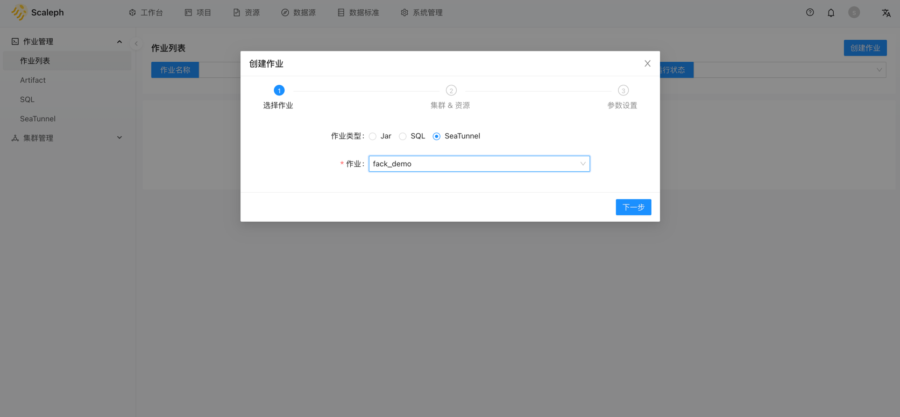
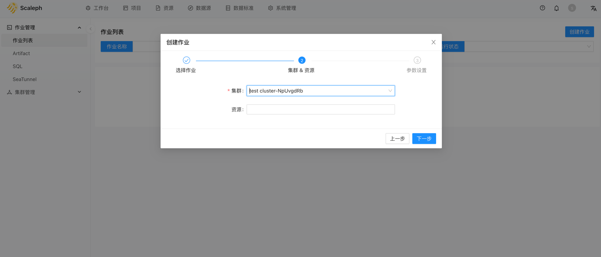
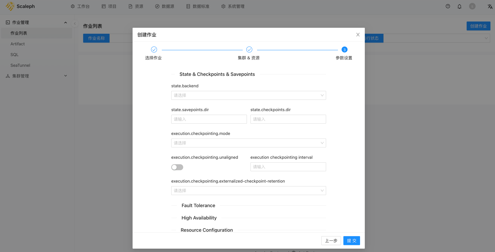
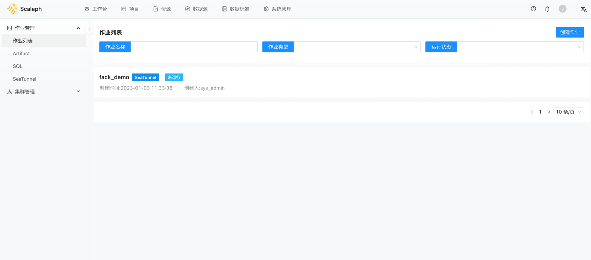

2. 进入作业详情 -> 启动作业

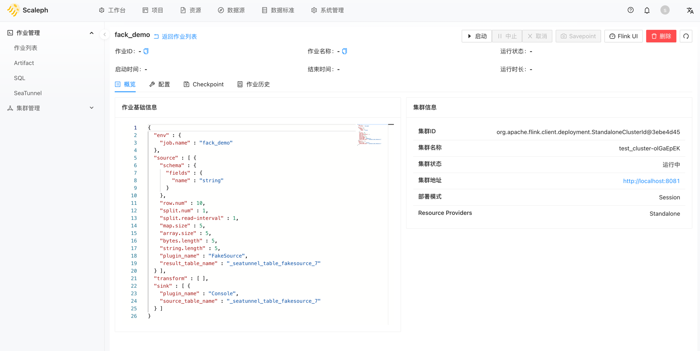
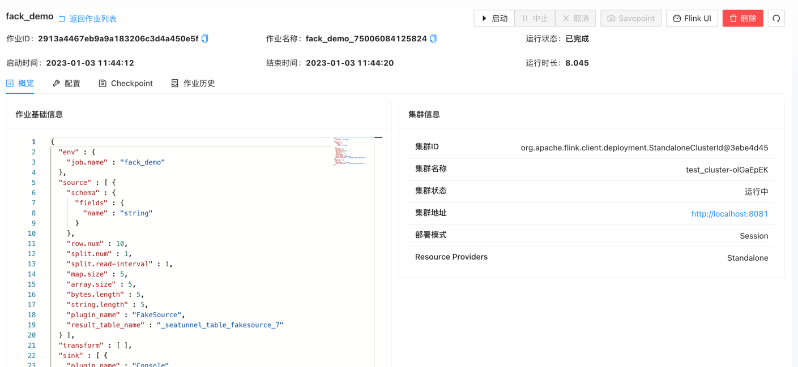

3. 查看flink集群任务信息

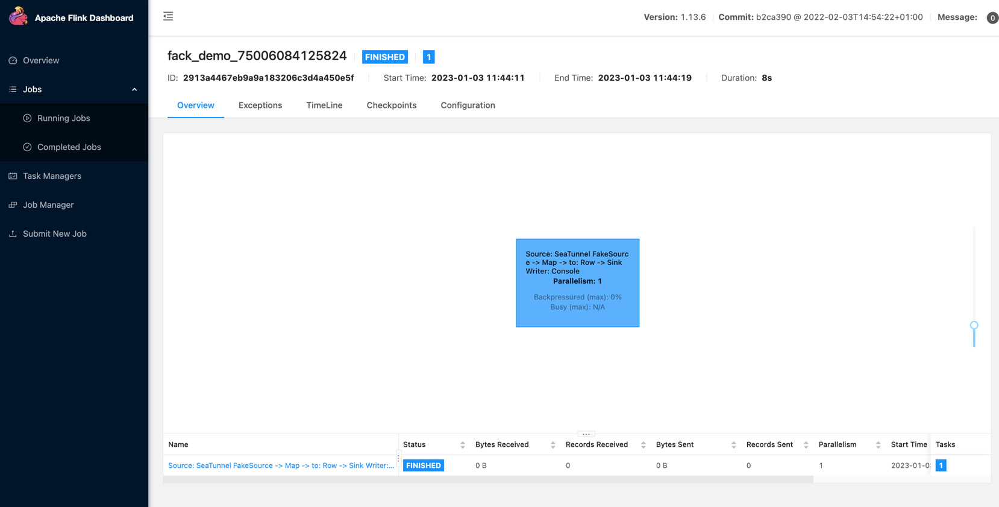