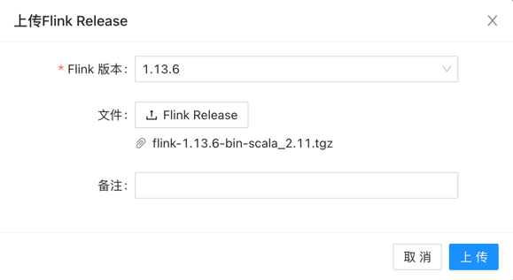
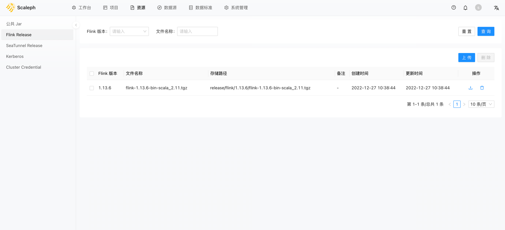
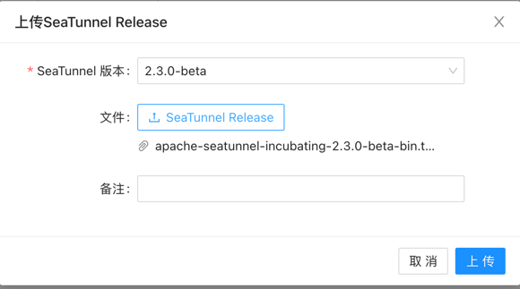
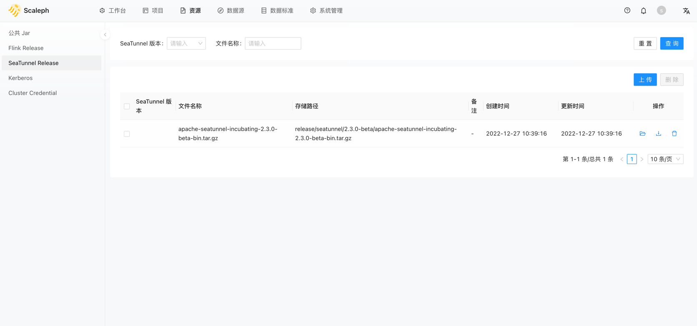

# 初始化
1. 上传 Flink release,当前仅支持 flink 1.13.6.
   1. 资源 -> Flink Release -> 上传
   
   2. Flink Release 
   
2. 上传 Seatunnel release,当前仅支持 v2.3.0
   1. 资源 -> Seatunnel Release -> 上传
   
   2. Seatunnel Release
   
   3. 上传Seatunnel Connectors
3. 创建集群凭证

# 创建集群
# 创建作业

## Seatunnel 
## Jar

# 部署作业